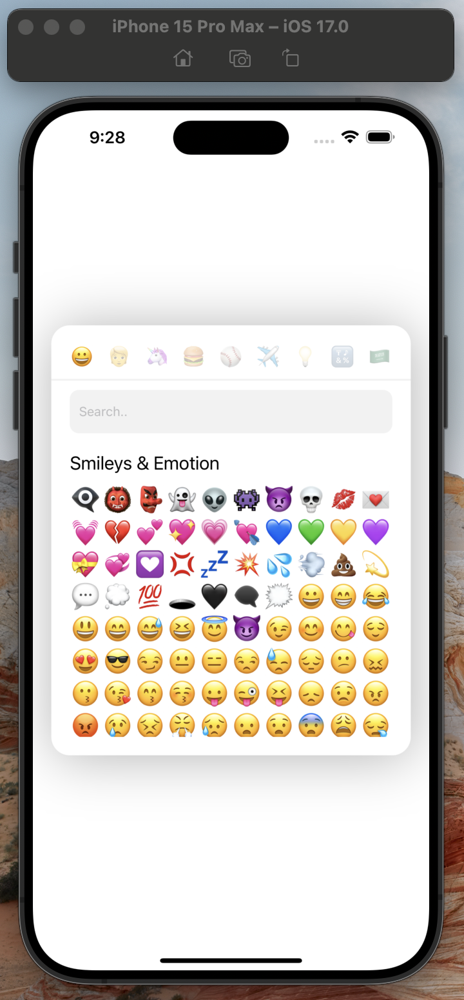
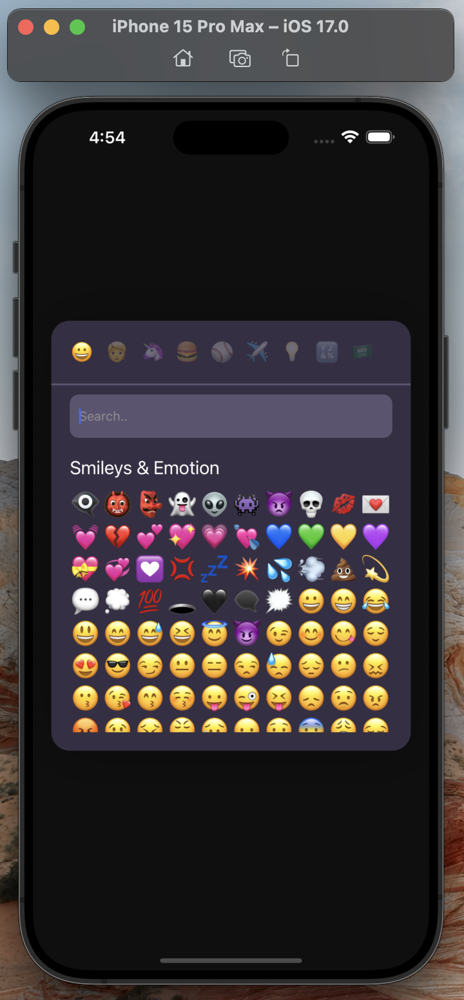

<h2 align="center">
react-native-emojis-picker
</h2>
<p align="center" color="red">
It's built with TypeScript and uses Reanimated 2 for smooth animations
</p>

|          light theme          |          dark theme          |
| :---------------------------: | :--------------------------: |
|  |  |

### Installation

```bash
npm install react-native-emojis-picker
```

### Dependencies

This library needs react-native-reanimated to be installed in your project before you can use it:

```bash
npm install react-native-reanimated@3.6.2
```

Add `react-native-reanimated/plugin` plugin to your `babel.config.js`.

```ts
  module.exports = {
    presets: [
      ... // don't add it here :)
    ],
    plugins: [
      ...
      'react-native-reanimated/plugin',
    ],
  };
```

### Usage

wrap the whole app in `EmojiProvider`

```ts
import { EmojiProvider } from "react-native-emojis-picker";
export default function App() {
  return <EmojiProvider>//rest your app</EmojiProvider>;
}
```

simple emoji component

```ts
import { Button, StyleSheet, Text, View } from "react-native";
import { useState } from "react";
import { EmojiModal } from "react-native-emojis-picker";

export default function EmojiComponent() {
  const [showModal, setShowModal] = useState(false);
  const [emoji, setEmoji] = useState("");
  return (
    <View style={styles.container}>
      <Text style={{ fontSize: 100 }}>{emoji}</Text>
      <Button
        title="Show Emojis Modal 😁"
        onPress={() => {
          setShowModal(true);
        }}
      />
      {showModal && (
        <EmojiModal
          onPressOutside={() => setShowModal(false)}
          onEmojiSelected={(emoji) => {
            setShowModal(false);
            setEmoji(emoji);
          }}
        />
      )}
    </View>
  );
}

const styles = StyleSheet.create({
  container: {
    flex: 1,
    backgroundColor: "#fff",
    alignItems: "center",
    justifyContent: "center",
  },
});
```

now import the component we just created into `App.tsx`

```ts
import { EmojiProvider } from "react-native-emojis-picker";
import EmojiComponent from "./components/emoji";
export default function App() {
  return (
    <EmojiProvider>
      <EmojiComponent />
    </EmojiProvider>
  );
}
```

### `EmojiModal` Props

|    Property     |             Type              |    Default     |                                                                                       description                                                                                        |
| :-------------: | :---------------------------: | :------------: | :--------------------------------------------------------------------------------------------------------------------------------------------------------------------------------------: |
|  intensityBlur  |            number             |       20       |                                                                           the intensity of the backgroud blur                                                                            |
|     columns     |            number             |       10       |                                                                                    number of columns                                                                                     |
| onEmojiSelected |           function            |   undefined    |                                                             function fire when emoji selected and return the selected emoji                                                              |
| onPressOutside  |           function            |   undefined    |                                                                   function fire when the user press outside the modal                                                                    |
|    position     | "top" or "bottom" or "center" |    "center"    |                                                                                  position of the modal                                                                                   |
| autoFocusSearch |            boolean            |     false      |                                                                              auto focus the search textbox                                                                               |
|    darkMode     |            boolean            |     false      |                                                                                    theme of the modal                                                                                    |
|   categories    |             Key[]             | All categories | only categories these are shown in the modal such as ( "Smileys & Emotion" "Activities" "Animals & Nature" "Flags" "Food & Drink" "Objects" "People & Body" "Symbols" "Travel & Places") |

### Author

Majed Al-Otaibi, Majed@skiff.com

### License

react-native-emojis-picker is available under the MIT license. See the LICENSE file for more info
